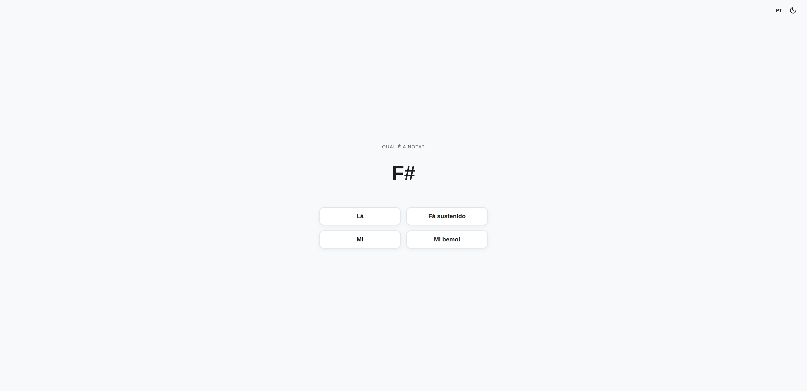

# 🎵 Note Decorator

This project is a **Note Decorator**, a minimalist web application designed to help musicians practice and memorize note names.

## Technologies

  

## Features

- Random generation of musical note quizzes.
- Built-in Spaced Repetition System (SRS) algorithm to prioritize missed notes.
- Integrated Dark and Light themes with an automatic system preference fallback.
- Bilingual interface toggle (English and Portuguese).

## Access the Website

You can access the Note Decorator online at: [note-decorator](https://vximoraes.github.io/note-decorator/)
